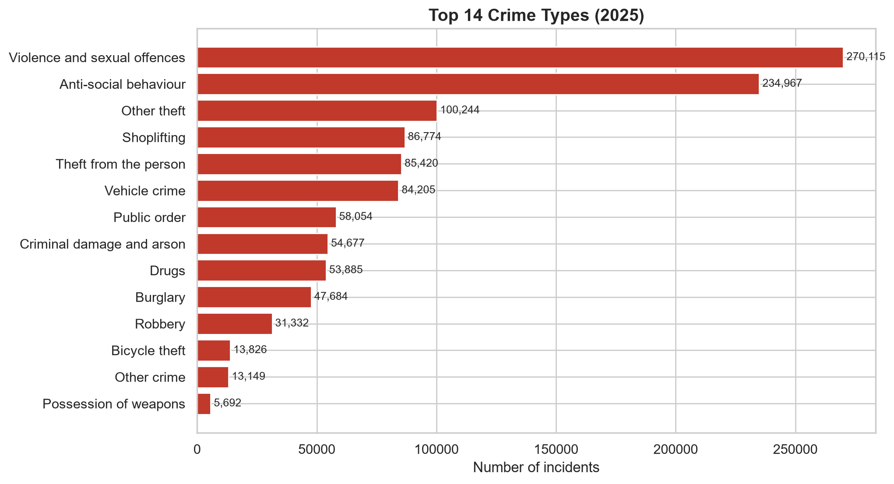
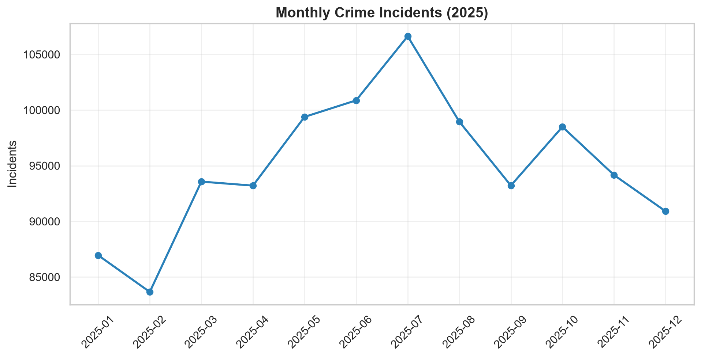
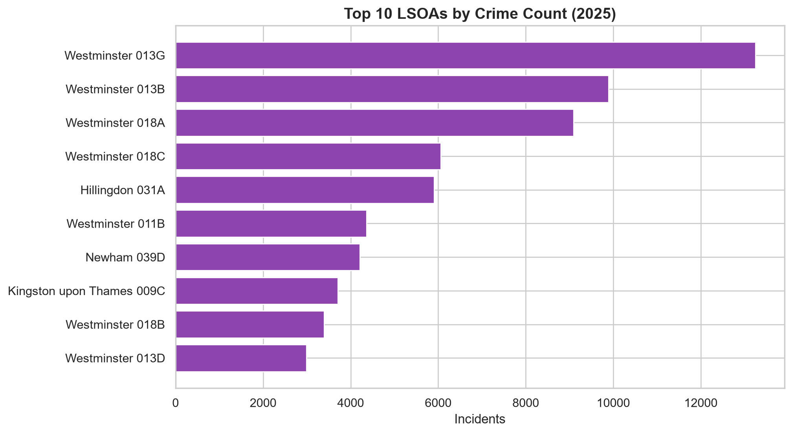
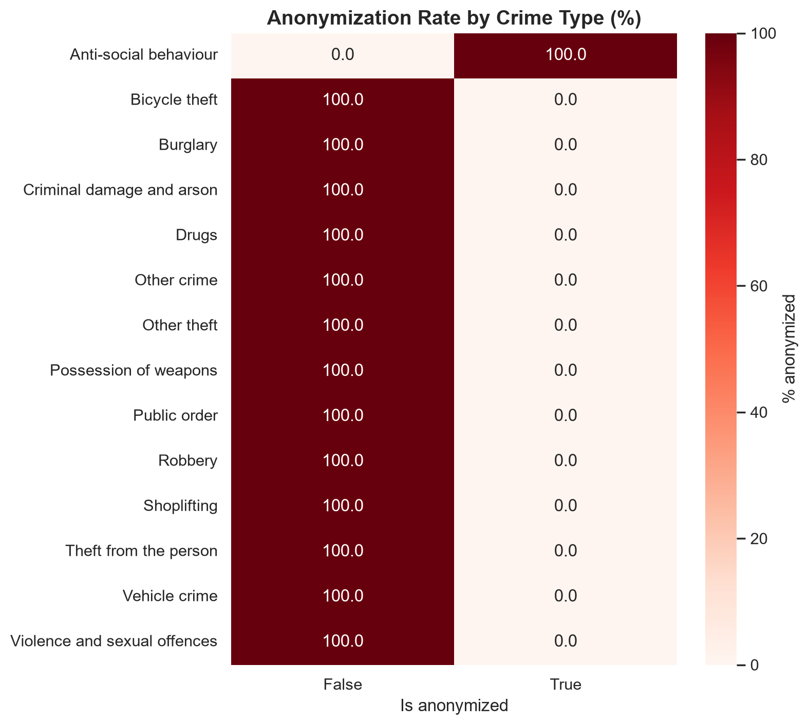
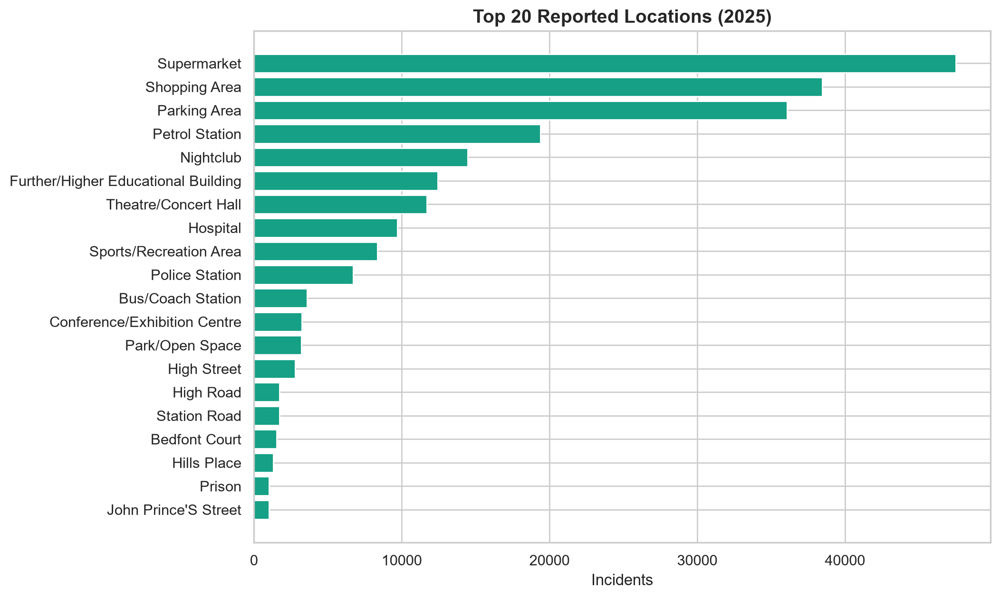

# 🚔 London Crime Analysis


## 📋 Overview

An end-to-end data engineering and analysis project built on **real, messy, incident-level crime data** from the [Police.uk API](https://data.police.uk/docs/). The project ingests ~1.14M raw incident records from the Metropolitan Police Service (2025), applies a documented cleaning pipeline, engineers temporal and spatial features, and produces a suite of statistical analyses and visualizations.

Unlike curated open-data releases, the Police.uk data reflects operational reality: missing identifiers, privacy redactions, nested anonymization, HTTP 404-as-zero-results quirks, and duplicate records that aren't always duplicates.


## 🎯 Key Findings

- **1,140,024** crime incidents reported by the Met Police in 2025 across **327 distinct LSOAs**
- **Violence and sexual offences** is the most common category (270,115 incidents, 23.7%)
- **Westminster 013G** is the single busiest LSOA (13,249 incidents)
- **20.6%** of records are privacy-redacted (missing Crime ID + outcome)
- **99.5%** of incidents occurred in Greater London boroughs; the remainder in surrounding counties (e.g. West Sussex)
- **Summer** shows the highest crime counts, **Winter** the lowest
- Chi-square tests confirm a seasonal pattern (p ≈ 0) and that crime type distribution varies significantly across LSOAs (p ≈ 0)


## 📈 Visualizations

### Crime Type Distribution


### Monthly Trend


### Top LSOAs by Incident Count


### Anonymization Rate by Crime Type


### Top Reported Locations



## 📊 Data Source

- **Source:** [Police.uk bulk download](https://data.police.uk/data/)
- **Force:** Metropolitan Police Service
- **Period:** 2025-01 → 2025-12 (12 monthly CSVs)
- **Raw records:** 1,140,416 incidents, 13 columns
- **Cleaned records:** 1,140,024 incidents, 10 columns


## 🧹 Cleaning Highlights

| Issue | Count | Decision |
|---|---|---|
| Empty strings | 1,610,350 | Normalized to `pd.NA` |
| `Context` column | 100% empty | Dropped |
| `Reported by` / `Falls within` | Constant | Dropped |
| Privacy-redacted records | 234,967 (20.6%) | Kept, flagged with `is_anonymized` |
| Exact duplicate rows | 392 | Dropped (only among non-null IDs) |
| `Crime ID` collisions | 4,513 groups | Column dropped (unreliable as unique key) |


## 🛠️ Tech Stack

- **Core:** Python 3.10+, pandas, numpy, pyarrow, scipy
- **Viz:** matplotlib, seaborn
- **Quality:** pytest (14 tests), structured logging, YAML config
- **Tooling:** pyproject.toml, Conventional Commits


## 📁 Project Structure

```
london-crime-analysis/
├── data/               # raw CSV + processed parquet (gitignored)
├── notebooks/
│   └── 01_exploration.ipynb
├── src/london_crime/
│   ├── config.py
│   ├── logging_config.py
│   ├── data_cleaning.py
│   ├── features.py
│   ├── eda.py
│   ├── hypothesis_testing.py
│   └── visualization.py
├── tests/              # 14 unit tests
├── scripts/
│   ├── combine_monthly_csvs.py
│   └── generate_reports.py
├── outputs/figures/    # 5 generated charts
├── reports/
│   ├── eda_report.md
│   └── hypothesis_report.md
├── config.yaml
├── main.py
└── pyproject.toml
```

## 🚀 How to Run

```powershell
# 1. Install
python -m venv .venv
.venv\Scripts\Activate.ps1
pip install -e ".[dev]"

# 2. Download Police.uk bulk data for 2025 (Metropolitan Police)
#    Place extracted month folders in data/raw/monthly/

# 3. Combine monthly CSVs
python scripts/combine_monthly_csvs.py

# 4. Run full pipeline
python main.py
```

## 🧪 Tests

```powershell
pytest tests/ -v
```

## 📝 License

MIT

## 🙌 Acknowledgments

- [Police.uk](https://data.police.uk/) for publishing open street-level crime data
- The open-source Python community